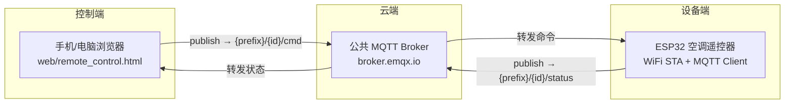

# ❄ ESP32 远程空调遥控器

> 通过 WiFi + 免费公共 MQTT 服务器，实现**全网（任何有网络的地方）远程控制 ESP32**。手机浏览器打开一个网页即可向设备发送指令，设备通过串口日志回应——为后续接入红外模块（真正发射空调指令）打下的第一块地基。

- **芯片**：ESP32（ESP-IDF v5.1.2 / FreeRTOS / C）
- **协议**：WiFi (STA) + MQTT 3.1.1 + JSON (cJSON)
- **控制端**：手机/电脑浏览器（WebSocket + mqtt.js），无需安装 App
- **云端**：免费公共 MQTT Broker（默认 `broker.emqx.io`），**无需服务器、无需内网穿透**

---

## 系统架构



**为什么这样就能"全网控制"**：手机和 ESP32 不需要互相知道对方的网络地址，两者都只连接公共 Broker 中转消息。只要都能上网，就能通信——这就是 MQTT「发布/订阅解耦」模型的核心价值（详见 [协议选型对比](#协议选型对比-mqtt-vs-串口--tcp--ros2)）。

## 功能特性

| 能力 | 说明 | 状态 |
|---|---|---|
| WiFi STA 连接 | 连路由器，断线自动重连 | ✅ |
| MQTT 收发 | 连接公共 Broker，订阅命令/回报状态 | ✅ |
| 设备唯一标识 | MAC 地址生成 device_id，主题互不冲突 | ✅ |
| JSON 命令解析 | cJSON 解析 `{"cmd":"on"}` 等指令 | ✅ |
| 命令分发接口 | `app_command_execute()`，预留红外接入点 | ✅ |
| 网页版遥控器 | 手机浏览器直接操作，无需 App（GitHub Pages 托管） | ✅ |
| 自动连接 | 打开网页即连接本机设备（开发阶段免登录） | ✅ |
| 电源指示灯 | `on`/`off` 命令驱动 GPIO（默认 D23），红外前可直观验证 | ✅ |
| 菜单化配置 | WiFi/MQTT/GPIO 参数走 menuconfig，无需改代码 | ✅ |
| 红外发射 | 发射空调红外码 | 🚧 待红外模块 |
| Android App | 原生控制端 | 🚧 路线图 |

## 快速开始

### 1. 配置参数（menuconfig）

```
VSCode: Ctrl+E, O   （或 ESP-IDF: Open Component Configuration）
```

进入 **`AC Remote Configuration`**，填写：

| 配置项 | 说明 | 默认值 |
|---|---|---|
| `WiFi SSID` | 你的路由器名称 | `your_ssid` |
| `WiFi Password` | 路由器密码 | 空 |
| `MQTT Broker URI` | 公共服务器地址 | `mqtt://broker.emqx.io` |
| `MQTT Username/Password` | 可选，公共服务器一般不填 | 空 |
| `MQTT Topic Prefix` | 主题前缀 | `/ac-remote` |
| `Power LED GPIO` | 电源指示灯引脚 | `23`（D23） |

### 2. 编译烧录

```
VSCode: Ctrl+E, B  编译
VSCode: Ctrl+E, D  烧录（选择串口）
```

### 3. 获取设备 ID

打开串口监视器（`Ctrl+E, S`），复位设备后应看到：

```
I (123) ac_remote: device_id=3c71bf
I (123) ac_remote: cmd topic    = /ac-remote/3c71bf/cmd
I (123) ac_remote: status topic = /ac-remote/3c71bf/status
... WiFi connected → Got IP → MQTT connected ...
```

`3c71bf` 就是你的设备 ID（MAC 后 3 字节 hex，每台设备唯一）。

### 4. 网页版遥控器

手机/电脑浏览器打开托管网址（GitHub Pages），**打开即自动连接，无需登录**：

> 🔗 **https://LCX-luo.github.io/esp32-wifi-ir-ac-remote/**

1. 页面加载后顶部状态变为"已连接"（设备 ID `e9a8e8` 显示在右上角，可在底部"高级设置"修改）。
2. 点 **⏻ 电源按钮**（开 / 关）。
3. 回到 ESP32 串口监视器，应看到命令执行 + LED 状态变化：

```
I (4567) ac_remote: received topic=/ac-remote/e9a8e8/cmd data={"cmd":"on"}
I (4567) ac_remote: [EXEC] >>> executing command: on
I (4567) ac_remote: [LED] power ON
```

> 本地调试也可：`web/` 目录运行 `python -m http.server 8000`，浏览器打开 `http://localhost:8000/remote_control.html`（高级设置里可改 Broker/前缀，平时无需改动）。

## 主题与消息格式

| 方向 | 主题 | 说明 |
|---|---|---|
| 控制端 → ESP32 | `{prefix}/{device_id}/cmd` | QoS 1，命令消息 |
| ESP32 → 控制端 | `{prefix}/{device_id}/status` | QoS 1 + 保留，状态消息 |

**命令消息**（当前阶段：`on`/`off` 驱动电源指示灯 GPIO；`mode`/`temp`/`fan` 仅解析记录，红外模块接入后执行）：

```json
{"cmd":"on"}                          // 开
{"cmd":"off"}                         // 关
{"cmd":"mode","mode":"cool"}          // 模式: auto/cool/heat/dry/fan
{"cmd":"temp","temp":25}              // 温度: 16~30
{"cmd":"fan","fan":"high"}            // 风速: auto/low/mid/high
```

**状态消息**（保留消息，控制端上线即可收到）：

```json
{"state":"online","device_id":"3c71bf"}
```

## 协议选型对比（MQTT vs 串口 / TCP / ROS2）

| 维度 | 串口 UART | TCP | **MQTT** | ROS2 |
|---|---|---|---|---|
| 协议层次 | 物理层 | 传输层 | 应用层（基于 TCP） | 机器人中间件（基于 DDS） |
| 通信模型 | 点对点（一对一） | 点对点 | **发布/订阅（多对多）** | 发布/订阅 + 服务 + 动作 |
| 谁连接谁 | 两根线直连 | 客户端连服务器 IP | 所有设备只连 Broker | DDS 自动发现 |
| 跨公网/远程 | ❌ 几米 | ⚠️ 需公网 IP 或内网穿透 | ✅ 天然支持（Broker 中转） | ⚠️ 局域网为主 |
| 应用层协议 | 自定义帧 | 自行定义 | **协议内建**（主题/QoS/遗嘱） | 内建类型化接口 |
| 多设备互通 | 一对一 | 服务端自写并发 | 内建，一个 Broker 管所有 | 内建 |
| 资源占用 | 最小 | 中 | 小（固定头仅 2 字节） | 大（需要 Linux） |
| ESP32 可用性 | ✅ | ✅ | ✅ 轻量客户端 | ⚠️ 需 micro-ROS |
| 典型场景 | 传感器直连、调试 | 自定义网络服务 | **IoT 上报/远程控制** | 机器人系统 |

> **选型结论**：远程控制需要设备跨越公网，串口物理上不可能；TCP 需要双方互知地址（家用宽带无公网 IP，需内网穿透）；ROS2 面向机器人系统、资源占用大、不适合裸机 ESP32。MQTT 通过 Broker 中转天然解决「全网互通」问题，且协议内建主题过滤、QoS、遗嘱消息，是物联网远程控制的标准答案。

## 安全说明（重要）

本项目默认使用**公共免费 Broker + 明文 MQTT（1883）**，仅用于演示与开发：
- 任何人可尝试连接公共 Broker，主题名是唯一的隔离手段（这也是用 MAC 生成 device_id 的原因）。
- 明文传输，不要传输敏感数据。
- 当前开发阶段网页未设访问控制，**任何人打开网址即可控制该设备**，请勿在公共环境长期使用；正式版需加入访问密码/令牌校验。
- **生产环境建议**：改用自建/云托管 Broker（如 EMQX Serverless），启用 TLS（`mqtts://`）、用户名密码认证、独立私密主题。本项目的 Kconfig 已预留 Username/Password 和 URI 配置位。

## 目录结构

```
control/
├── main/
│   ├── main.c              # 入口：WiFi + MQTT + 命令分发（红外接入点）
│   ├── Kconfig.projbuild   # menuconfig 配置（WiFi/MQTT）
│   └── CMakeLists.txt      # 组件声明
├── web/
│   └── remote_control.html # 网页版遥控器（手机/电脑浏览器）
├── docs/
│   ├── architecture.md     # 架构与代码结构设计
│   └── error-fixes.md      # 错误修复报告（持续更新）
├── README.md
└── CHANGELOG.md            # 版本记录
```

## 路线图

- [x] **v0.1.0** — WiFi + MQTT 远程控制链路跑通（网页版遥控器 + 串口日志验证）
- [ ] **v0.2.0** — 接入红外模块，命令映射为空调红外码并发射
- [ ] **v0.3.0** — 状态上报增强（温度/模式/风速回显）、自动重连优化
- [ ] **v1.0.0** — Android App 控制端、OTA 远程升级、TLS 加密

## 项目亮点（简历可用）

- 完整实践 **MQTT 发布/订阅模型** 与物联网远程控制架构，理解 Broker 解耦如何实现跨公网通信。
- 掌握 ESP-IDF **WiFi 事件驱动编程、MQTT 客户端、cJSON 解析** 的完整开发链路。
- 工程化：**menuconfig 参数化、设备唯一标识、版本记录、错误修复报告** 全流程文档化。
